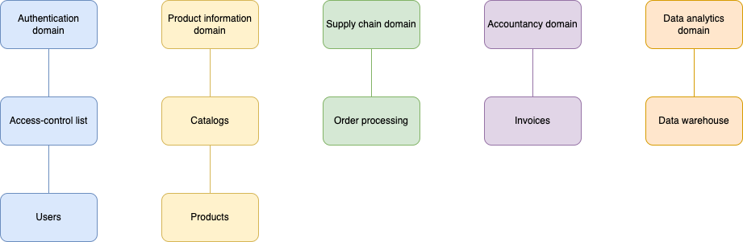
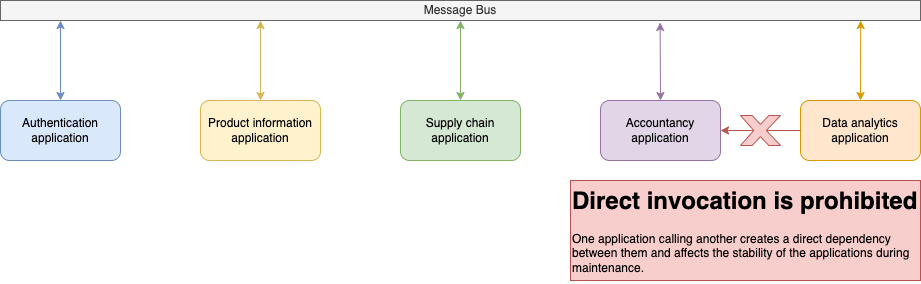
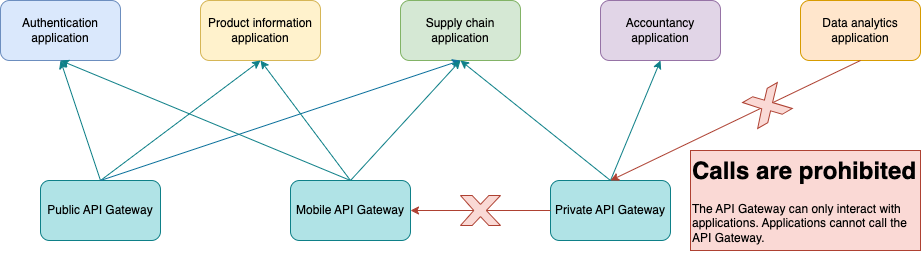
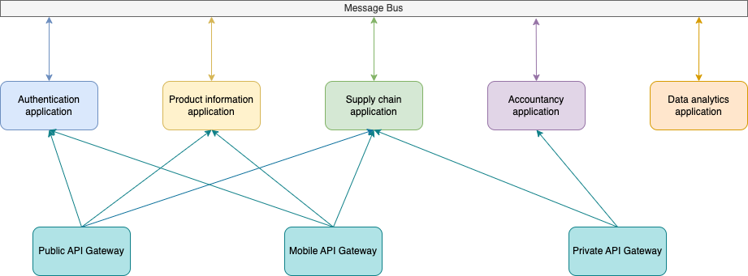
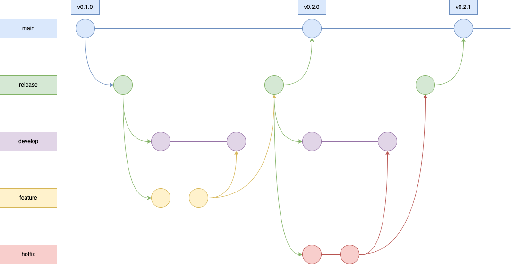

# Web Application Architecture

## Preamble

The infrastructure of large, high-load web services consists of a vast number of components. These components are sometimes maintained by teams that are not even familiar with each other. Therefore, when designing, it is important to consider that both external users and internal users will interact with your application.

Let's take an online store as an example, specifically the process of placing an order and issuing an invoice. First, let's describe the business process of placing an order:

- The user logs in
- Searches for a product in the catalog
- Adds the product to the cart and confirms it
- The order is placed and the user is issued an invoice for payment

Many departments of the company are involved in this process. The catalog is formed by the marketing department. The order is processed by another department. Invoicing is handled by the accounting department. Meanwhile, the analytics department collects data so that the marketing department can easily form the catalog, and so on. Each department may have its own development team or teams.

Let's set the tasks that need to be solved at the architecture level:

- Avoid dependency hell
- Ensure the stable operation of all applications
- Ensure the security of sensitive data

## Service-oriented architecture

Let's divide the business process into domain zones according to the departments that process the order.

By describing the process and dividing it into domains, we can begin to form the architecture of the future application. To do this, we will use the concept of Service-oriented architecture.

Let's define the key concepts we will use:

### Application

The application provides a business capability. It can implement multiple domains divided according to the principles of Domain Driven Design.

### Message Bus

A message bus allows different systems to communicate through a shared set of interfaces. Examples of message buses include Kafka, RabbitMQ, AWS SQS + SNS and Azure Event Hub.

### API Gateway

The API gateway is an entry point for API calls that represent client requests to target applications. Clients can be both external applications and internal applications from other development teams.

## Interaction of Applications

Let's divide domains according to the principle of one domain per application. The principle of dividing domains into applications can be chosen differently, for example, based on the teams that will support their part of the functionality. Let's draw a diagram of how applications interact with each other.

Applications should interact with each other only through a message bus. Failing to adhere to this rule can lead to dependency hell, where even minor changes in one application can cause issues in another, compromising the stability of the entire functionality.

The main advantage of a message bus over direct invocation is that in case of a failure, the request to the application remains in the queue and will be processed once the issue is fixed. With direct invocation between applications, there is a high chance of losing some data. 

## Interaction between the API Gateway and Applications

The API Gateway handles only the invocation of applications. It is necessary to unify all parts of the business logic into a single process and provide the client with a unified interface for interacting with all components of the system.

The API Gateway should only interact with applications. Its role in the system is to aggregate dependencies between applications and maintain data consistency.

A major challenge in application interaction is data consistency. By implementing the Saga pattern on the API Gateway side, we can create transactions between applications that preserve data consistency.

## Complete infrastructure diagram

These approaches solve two out of three problems. The number of interactions between applications is reduced, which prevents dependency hell.

Domains are hidden behind the API Gateway, which conceals the entire infrastructure and consolidates dependencies, making debugging easier in case of breakdowns. Additionally, limiting access to specific applications helps protect sensitive data.

## Git Flow/Trunk-Based development and Semantic Versioning

Git Flow/Trunk-Based and [Semantic Versioning](https://semver.org/)  will help achieve the last stated goal - ensuring the stable operation of all applications.

### Semantic Versioning

Semantic Versioning is implemented using tags in Github/Gitlab/Bitbucket/etc. It's best to start versioning from v0.1.0 and avoid moving to v1.0.0 while the application is still in the MVP (Minimum Viable Product) stage and changing frequently. Transitioning to version v1.0.0 in this case will signify the project's exit from the MVP stage.

Given a version number MAJOR.MINOR.PATCH, increment the:

1. MAJOR version when you make incompatible API changes
2. MINOR version when you add functionality in a backward compatible manner
3. PATCH version when you make backward compatible bug fixes

### [Git Flow](https://www.atlassian.com/git/tutorials/comparing-workflows/gitflow-workflow) vs [Trunk-Based development](https://trunkbaseddevelopment.com/)

The approach to building the release process depends entirely on the business processes. Each approach has its pros and cons, and there are ongoing debates about which method is best for each process.

Here, a hybrid approach will be described, which was specifically suited to a particular process based on a specific business process. It is not a universal approach and serves only as an example.

In this example, the process is set up with two long-lived branches, main (production) and release (pre-production), and one short-lived branch, develop.

When developing a feature, developers branch off from release and merge into the develop branch where the feature is tested. If the feature passes the testing stage, it is merged into release. At the end of the sprint, a regression test of the release branch is conducted. After regression, the release branch is merged into main and gets a version. This version is then deployed to the production instances. The develop branch is archived, and a new one is created, inheriting from the release branch.

This approach has proven effective in cases where unplanned tasks were added to the sprint, requiring the removal of planned tasks that were already in progress and being tested in the develop branch.

In case a feature needs to be rolled back from the release branch, it is done smoothly. It then undergoes regression and is merged into the main branch, receiving the next version.

### Release train

For synchronizing dependencies between applications, it is crucial for management to coordinate the synchronization of releases in case dependencies arise between teams. The concept of a release train comes from the Agile framework called SAFe.

An Agile release train is a cross-functional team dedicated to achieving a specific goal set by the company.